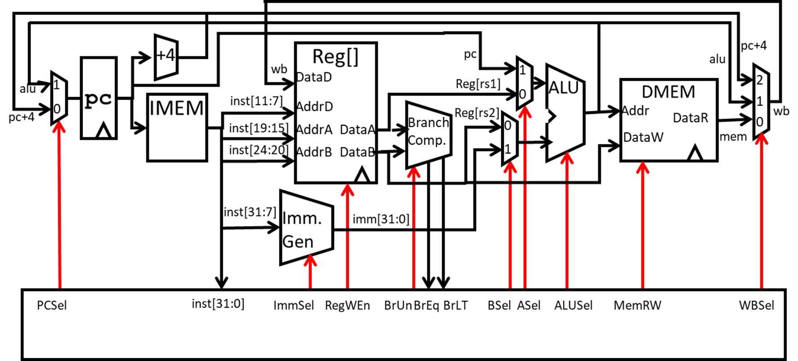
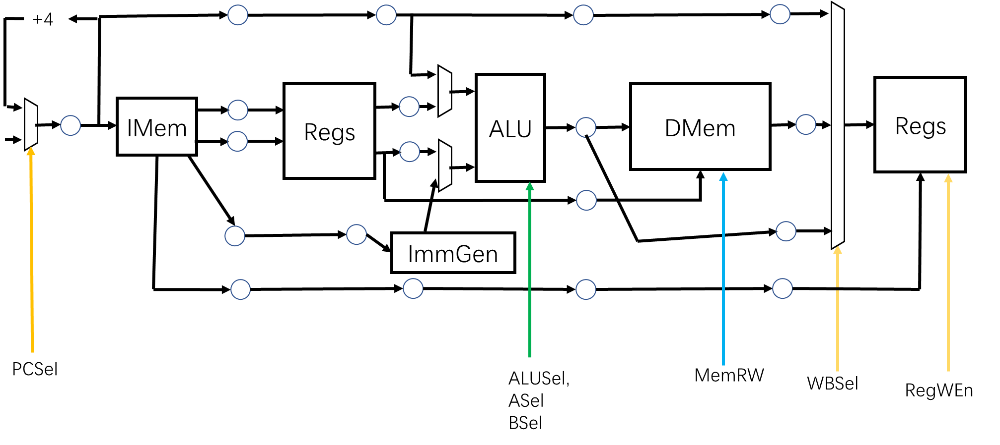
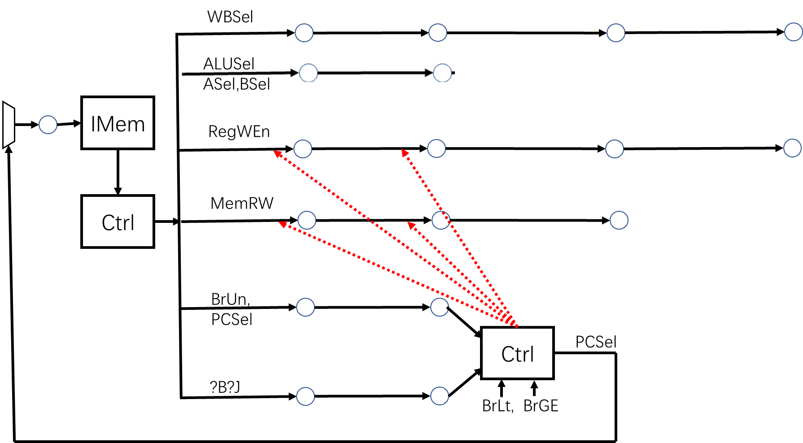
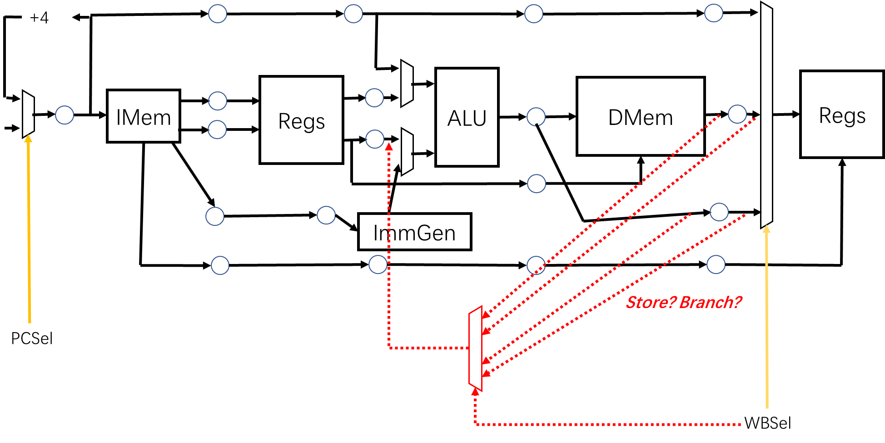
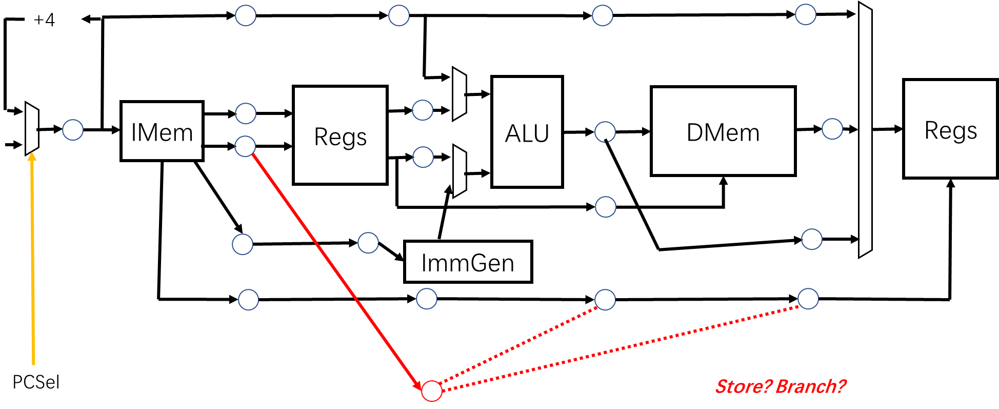
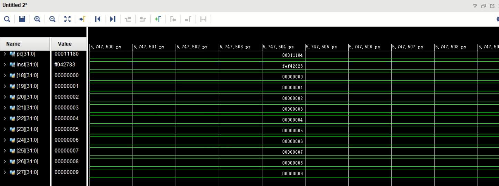
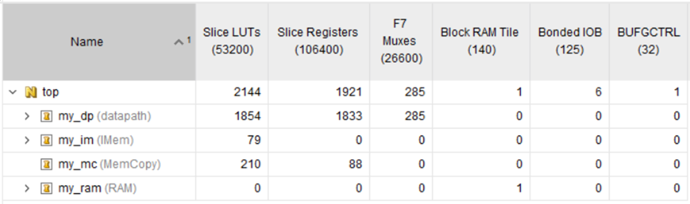
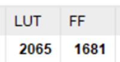
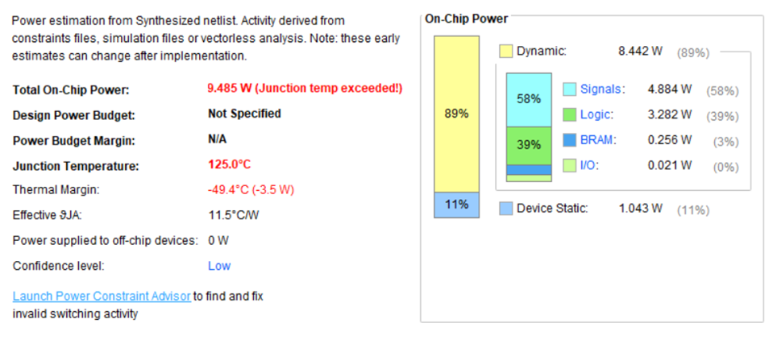
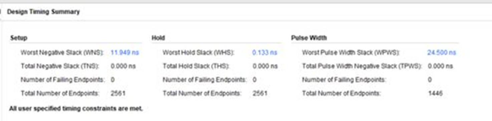

<center><h1>基于 RSIC-V ISA 的</h1></center>
<center><h1>5 级流水线处理架构设计</h1></center>

[TOC]

## 功能描述

- 基础功能：实现了六种 RV32I 指令，可以按照给定的机器指令码实现中央处理器和内存的交互（以冒泡排序为例）
- 扩展功能：
    1. 模拟现代计算机的开机过程，实现了将初始指令从 ROM 拷贝到动态 RAM 的过程，作为执行指令的准备工作，让处理器能够在 RAM 上开机。
    2. 将一次工作周期划分为 5 个阶段，实现了 5 级流水线，规避了 B 型指令和 J 型指令的控制混乱（Control Hazard）问题。
    3. 在扩展功能二的基础上，规避了数据混乱（Data Hazard）问题，使用类似计分板的模式实现了将尚未写回寄存器的数据先返还给 ALU 前端的功能。

## 设计思路

### 一、基础功能

基础功能的架构图和课程中一致，需要分别实现：

- 时序逻辑
    - PC 寄存器每个时钟周期加 4
    - 寄存器的写回
    - 内存的读写
- 组合逻辑
    - ALU
    - 比较单元
    - 寄存器阵列的读
    - 控制模块
    - 立即数生成器
    - 各种选通等



很多模块在之前的小型作业中已经完成，这里提供新的代码

比较单元：

```verilog
module BranchComp (
    input [31:0] DataA,
    input [31:0] DataB,
    input BrUn,
    output reg BrEQ,
    output reg BrLT
);
  always @(*) begin
    if (DataA == DataB) begin
      BrEQ = `BrEQ_BEQ;
      BrLT = `BrLT_BGE;
    end else begin
      BrEQ = `BrEQ_BNE;
      case (BrUn)
        `BrUn_UNSIGNED: begin
          if (DataA < DataB) begin
            BrLT = `BrLT_BLT;
          end else begin
            BrLT = `BrLT_BGE;
          end
        end
        `BrUn_SIGNED: begin
          if ($signed(DataA) < $signed(DataB)) begin
            BrLT = `BrLT_BLT;
          end else begin
            BrLT = `BrLT_BGE;
          end
        end
      endcase
    end
  end
endmodule
```

立即数生成器：

```verilog
module ImmGen (
    input [24:0] inst_imm,
    input [2:0] ImmSel,
    output reg [31:0] imm
);
  always @(*) begin
    case (ImmSel)
      `ImmSel_I: begin
          imm[11:0]  = inst_imm[24:13];
          imm[31:12] = {(32 - 12) {imm[11]}};
      end
      `ImmSel_S: begin
        imm[11:5]  = inst_imm[24:18];
        imm[4:0]   = inst_imm[4:0];
        imm[31:12] = {(32 - 12) {imm[11]}};
      end
      `ImmSel_B: begin
        imm[12] = inst_imm[24];
        imm[11] = inst_imm[0];
        imm[10:5] = inst_imm[23:18];
        imm[4:1] = inst_imm[4:1];
        imm[0] = 1'b0;
        imm[31:13] = {(32 - 13) {imm[11]}};
      end
      `ImmSel_J: begin
        imm[20] = inst_imm[24];
        imm[19:12] = inst_imm[12:7];
        imm[11] = inst_imm[13];
        imm[10:1] = inst_imm[23:14];
        imm[0] = 1'b0;
        imm[31:21] = {(32 - 21) {imm[11]}};
      end
      `ImmSel_U1: begin
        imm[31:12] = inst_imm[24:5];
        imm[11:0]  = 12'h000;
      end
      `ImmSel_U2: begin
        imm[31:12] = inst_imm[24:5];
        imm[11:0]  = 12'h000;
      end
      default: imm[31:0] = 32'h00000000;
    endcase
  end
endmodule
```

### 二、扩展功能：从 RAM 启动

> [!question] 为什么要做这项功能？
> 
> 观察提供的汇编语言代码会发现如下的字句：
>
> ```asm
> 	int arr[] ={9, 8, 7, 4, 5, 6, 1, 2, 3, 0};
   10064:	000107b7          	lui	a5,0x10
   10068:	1fc7a483          	lw	s1,508(a5)
   1006c:	1fc78713          	addi	a4,a5,508
   10070:	00472383          	lw	t2,4(a4)
   10074:	1fc78713          	addi	a4,a5,508
> ```
> 
> 数组在初始化时，并没有发现将数组元素直接作为立即数加到寄存器中。寄存器中的数据来自于内存的某个地方，此处为 0x10508。经过检查，发现此地址刚好是程序机器码结束后的地方。继续观察提供的 coe 文件（用于对 Vivado 中的 ROM IP 核初始化数据），发现猜想成立，数组中的数据按顺序排列在指令机器码的后面。
> 
> 这意味着，此机器码在冯诺依曼架构下易于实现，因为数组数据和指令码位于同一内存，使用同一套地址。但是在 Vivado 中，只能对只读的 ROM IP 核进行初始化，类似现代计算机中存储设备启动代码的 ROM。因此必须完成一个将 ROM 中写死的数据拷贝到动态 RAM 的硬件结构。

整个项目的硬件架构图如下所示：


图中，ROM 和 RAM 为 Vivado 提供的 IP 核，CORE 为自行编写的 RSIC-V 中央处理器。下方的 BOOT 结构实现了内存拷贝的功能，将 ROM 中初始化的数据搬移到 RAM 中，这样中央处理器就可以从 RAM 中启动并在其中构建栈区作为数据内存了。BOOT 模块的硬件描述如下：

```verilog
`define ROM_BEGIN 32'h00000000
`define ROM_END 32'h00000200

module MemCopy (
    input clk,
    input rst,
    input [31:0] ROM_Data,
    output reg available,
    output reg [31:0] ROM_Addr,
    output reg [31:0] RAM_Addr,
    output [31:0] RAM_Data,
    output reg MemRW
);
  initial begin
    available = 1'b0;
    ROM_Addr = `ROM_BEGIN - 4;
    RAM_Addr = `PC_START_ADDR - 4;
    MemRW = `MemRW_S;
  end
  assign RAM_Data = ROM_Data;
  always @(posedge clk, posedge rst) begin
    if (rst == 1'b0) begin
      if ($signed(ROM_Addr) >= $signed(`ROM_END)) begin
        available <= 1'b1;
        MemRW <= `MemRW_L;
      end else begin
        ROM_Addr <= ROM_Addr + 4;
        RAM_Addr <= RAM_Addr + 4;
      end
    end else begin
      available = 1'b0;
      ROM_Addr = `ROM_BEGIN - 4;
      RAM_Addr = `PC_START_ADDR - 4;
      MemRW = `MemRW_S;
    end
  end
endmodule
```

在 BOOT 模块任务完成以后，将寄存器 available 的值置为有效，中央处理器接收到这个信号后开始运行程序。整个架构的硬件描述如下：

```verilog
module top (
    input clk,
    input rst,
    output [3:0] sp_part
);
  wire [31:0] pc;
  wire [31:0] inst;
  wire [31:0] s_data;
  wire [31:0] addr;
  wire [31:0] l_data;
  wire [31:0] dp_ram_addr;
  wire [31:0] dp_ram_data;
  wire dp_ram_rw;
  wire [31:0] rom_data;
  wire avail;
  wire [31:0] rom_addr;
  wire [31:0] mc_ram_addr;
  wire [31:0] mc_ram_data;
  wire mc_ram_rw;
  wire mem_rw;
  wire [31:0] sp;
  assign sp_part = sp[3:0];
  datapath my_dp (
      .clk(clk),
      .rst(~avail),
      .inst(inst),
      .l_data(l_data),
      .addr_inst(pc),
      .addr_data(dp_ram_addr),
      .s_data(dp_ram_data),
      .mem_rw(dp_ram_rw),
      .sp(sp)
  );
  MemCopy my_mc (
      .clk(clk),
      .rst(~rst),
      .ROM_Data(rom_data),
      .available(avail),
      .ROM_Addr(rom_addr),
      .RAM_Addr(mc_ram_addr),
      .RAM_Data(mc_ram_data),
      .MemRW(mc_ram_rw)
  );
  IMem my_im (
      .a(rom_addr[9:2]),  // input wire [7 : 0] a
      .spo(rom_data)  // output wire [31 : 0] spo
  );
  RAM my_ram (
      .clka (~clk),        // input wire clka
      .ena  (1'b1),        // input wire ena
      .wea  (1'b0),        // input wire [0 : 0] wea
      .addra(pc[11:2]),    // input wire [9 : 0] addra
      .dina (0),           // input wire [31 : 0] dina
      .douta(inst),        // output wire [31 : 0] douta
      .clkb (~clk),        // input wire clkb
      .enb  (1'b1),        // input wire enb
      .web  (mem_rw),      // input wire [0 : 0] web
      .addrb(addr[11:2]),  // input wire [9 : 0] addrb
      .dinb (s_data),      // input wire [31 : 0] dinb
      .doutb(l_data)       // output wire [31 : 0] doutb
  );
  assign mem_rw = (avail == 1'b1) ? dp_ram_rw : mc_ram_rw;
  assign s_data = (avail == 1'b1) ? dp_ram_data : mc_ram_data;
  assign addr   = (avail == 1'b1) ? dp_ram_addr : mc_ram_addr;
endmodule
```

### 三、扩展功能：五级流水线

五级流水线将处理器执行一个指令的过程分为 5 步：

1. 指令获取
2. 从寄存器读
3. ALU 计算、比较
4. 和数据内存交互
5. 写回寄存器

五级流水线的核心在于流水，难点在于将硬件分成 5 个相对独立的部分，相邻的步骤之间用寄存器相连，这个寄存器的目的是保存上一步骤完成以后的结果。本项目的数据流图如下所示：



图中的小圆圈即为寄存器，在时钟周期上升沿会将输入的信号暂存供下一步骤读取。对于一串寄存器，实现了抽象硬件模块：移位寄存器。硬件描述如下，其中参数 STEP 为移位寄存器的长度，WIDTH 为一个寄存器的数据存储量（位宽），RST 为初始化值，其长度等于 WIDTH.

```verilog
module ShiftReg #(
    parameter STEP  = 4,
    parameter WIDTH = 1,
    parameter RST   = 1'b0
) (
    input clk,
    input rst,
    input [WIDTH-1:0] in,
    output [WIDTH-1:0] out
);
  integer i;
  reg [WIDTH-1:0] Info[STEP-1:0];
  assign out = Info[0];
  always @(posedge clk, posedge rst) begin
    if (rst == 1'b1) begin
      for (i = 0; i < STEP; i = i + 1) begin
        Info[i] <= RST;
      end
    end else begin
      for (i = 0; i < STEP - 1; i = i + 1) begin
        Info[i] <= Info[i+1];
      end
      Info[STEP-1] <= in;
    end
  end
endmodule
```

第二阶段和第五阶段的寄存器阵列在物理上是同一个部件，但是在流水线技术的要求中是“两个模块”。为了防止冲突，将从寄存器读作为组合逻辑，写回寄存器为时序逻辑，触发源为时钟周期下降沿（为了防止和流水线寄存器的触发源：时钟周期上升沿相同而引发竞争冒险现象）。

与数据的分割很相似，对控制信号也应该做分割。在某一时刻，不同的步骤所对应的硬件结构在执行不同的指令，因此必须抛弃单周期处理器中一个控制模块的输出直接接到各个组合逻辑模块的连接方法，而应该将这些控制信号根据它们被调用的步骤分类，送入不同长度的移位寄存器以后将输出接到对应的模块。控制流图如下所示：



以 WBSel 控制信号为例，它发生作用在第五步：寄存器写回，但是和所有控制信号一样，它们都是在第一步：指令获取阶段就已经被控制模块解析出来了。由于此时第五步的硬件模块还在执行之前的指令，因此此时在第一步生成的 WBSel 不能直接送入，而应该送入移位寄存器中等待，等待的长度为：$5-1=4$. 之后从移位寄存器输出这个 WBSel 信号时，这个指令也刚好执行到第五步。

> [!attention] Control Hazard
> 这里说明本项目关于 Control Hazard 的处理方法。
> 
> Control Hazard 是由两类指令引起的：B 型指令和 J 型指令。两个指令是否跳转、怎么跳转都必须在第三步完成以后才能知道。因此相应的控制逻辑应该在第三步硬件单元中，并且需要另设一个 ``?B?J`` 信号来表征是不是 B 型指令和 J 型指令。此处的控制逻辑（图中 Ctrl）读入 ``BrUn, ?B?J, BrLt, BrGE, PCSel`` 信号（这里的 ``PCSel`` 当且仅当是 J 型指令时不为 +4 的情况），返回 PCSel 的值，作为 PC 寄存器下一时刻值的选通。
> 
> 由于只有到了第三步骤才能判断出是否发生跳转，因此判断出来的时刻位于第一步骤和第二步骤的指令都要被“抹除”，也就是转化成 Bubble 指令。Bubble 指令的核心在于它不对系统的存储数据造成影响，因此可以通过异步地修改控制信号 ``RegWEn, MemRW`` 为寄存器不可写，内存读的状态，消除 Bubble 指令执行对内存和寄存器的影响。这里使用组合逻辑对寄存器中的值进行清零，用红色虚线表示。
> 
> 代码实现如下：

```verilog
module BranchController (
    input [3:0] isB,
    input BrEQ,
    input BrLT,
    input PCSel_In,
    output reg PCSel_Out,
    output reg Clear
);
  always @(*) begin
    if (isB[3] == 1'b0) begin
      PCSel_Out = `PCSel_4;
      Clear = 1'b1;
    end else begin
      case (isB[2:0])
        `funct3_J: begin
          PCSel_Out = `PCSel_ALU;
          Clear = 1'b0;
        end
        `funct3_notBJ: begin
          PCSel_Out = PCSel_In;
          Clear = 1'b1;
        end
        `funct3_BEQ: begin
          PCSel_Out = (BrEQ) ? `PCSel_ALU : `PCSel_4;
          Clear = (BrEQ) ? 1'b0 : 1'b1;
        end
        `funct3_BNE: begin
          PCSel_Out = (BrEQ) ? `PCSel_4 : `PCSel_ALU;
          Clear = (BrEQ) ? 1'b1 : 1'b0;
        end
        `funct3_BLT: begin
          PCSel_Out = (BrLT) ? `PCSel_ALU : `PCSel_4;
          Clear = (BrLT) ? 1'b0 : 1'b1;
        end
        `funct3_BGT: begin
          PCSel_Out = (BrLT) ? `PCSel_4 : `PCSel_ALU;
          Clear = (BrLT) ? 1'b1 : 1'b0;
        end
        `funct3_BLTU: begin
          PCSel_Out = (BrLT) ? `PCSel_ALU : `PCSel_4;
          Clear = (BrLT) ? 1'b0 : 1'b1;
        end
        `funct3_BGEU: begin
          PCSel_Out = (BrLT) ? `PCSel_4 : `PCSel_ALU;
          Clear = (BrLT) ? 1'b1 : 1'b0;
        end
      endcase
    end
  end
endmodule
```

### 四、扩展功能：数据前馈

为了在上一个扩展功能的基础上进一步减少程序中断的次数，增加了数据前馈的功能。数据前馈的出现是为了防止 Data Hazard，即上一步（或上两步）的 rd 寄存器作为此时的 rs1 或 rs2，但是由于 rd 还没有写回寄存器，因此此时准备输入 ALU 的 rs1 或 rs2 是无效的（因为是从寄存器写回之前取数据）。为了不让流水线中断，可以将此时 ALU 输出端的寄存器或从数据内存读入的寄存器引回 ALU 的输入。如下图所示：



上图中的 4 个红色虚线表达了数据前馈的四种来源：

1. 上一步 ALU 计算的结果
2. 上二步 ALU 计算的结果
3. 上一步 Load 的结果
4. 上二步 Load 的结果

具体选 ALU 计算结果还是 Load 的结果，可以使用此步骤的 WBSel 来判断，具体选择上一步的结果、上两步的结果还是不进行 Forward，则需要类似记分板的结构来实现，计分板中存储上一步和上两步的 rd，将此时的 rs1 和 rs2 分别和它比较。如下图所示：



将比较的结果作为上一图的选通就可以选择合适的 Forward 了。

> [!attention] Data Forward vs. Control Hazard
> 此时要注意 Control Hazard 中的副作用：由于 B 型指令和 J 型指令的跳转，后续两步的指令作 Bubble 处理，此时要专门重新写一个移位寄存器表征是不是 Bubble，这里选择与之前的 ?B?J 复用。在对记分板进行比对时，先要看此时是不是 Bubble，如果是，则不再考虑 Forward 数据，直接选用来自寄存器，即正常数据流的数据作为 ALU 的输入。

代码实现如下：

```verilog
module Forward (
    input [4:0] Addr,
    input [4:0] AddrD4,
    input RDValid4,
    input [4:0] AddrD5,
    input RDValid5,
    input WBSel4,
    input WBSel5,
    input [31:0] DataALU4,
    input [31:0] DataALU5,
    input [31:0] DataMem4,
    input [31:0] DataMem5,
    input [31:0] DataIn,
    output [31:0] DataOut
);
  wire [1:0] ForwardSel;
  assign ForwardSel[1] = (Addr == AddrD5) & (RDValid5 == 1'b1);  // data hazard
  assign ForwardSel[0] = (Addr == AddrD4) & (RDValid4 == 1'b1);  // in which step
  wire [31:0] DataForward4 = (WBSel4 == 1'b1) ? DataALU4 : DataMem4;
  wire [31:0] DataForward5 = (WBSel5 == 1'b1) ? DataALU5 : DataMem5;
  wire [31:0] DataForward = (ForwardSel[0]) ? DataForward4 : DataForward5;
  assign DataOut = (Addr == 5'b00000) ? 5'b00000 : ((ForwardSel[0] | ForwardSel[1]) ? DataForward : DataIn);
endmodule
```

## 测试平台

测试平台提供一个正常的时钟信号。

```verilog
module tb();
  reg clk;
  reg rst;
  wire [3:0] sp;
  top mytop (
      clk,
      rst,
      sp
  );
  initial begin
    rst = 0;
    clk = 0;
    #1 rst = 1;
    forever begin
      #1 clk = ~clk;
    end
  end
endmodule
```

## 结果说明

为了在行为级仿真中看到正确的结果，我在汇编中加入了部分代码

```asm
   101b4:	fc442903          	lw	s2,-60(s0) # 18=10010
   101b8:	fc842983          	lw	s3,-56(s0) # 10011
   101bc:	fcc42a03          	lw	s4,-52(s0) # 10100
   101c0:	fd042a83          	lw	s5,-48(s0) # 10101
   101c4:	fd442b03          	lw	s6,-44(s0) # 10110
   101c8:	fd842b83          	lw	s7,-40(s0) # 10111
   101cc:	fdc42c03          	lw	s8,-36(s0) # 11000
   101d0:	fe042c83          	lw	s9,-32(s0) # 11001
   101d4:	fe442d03          	lw	s10,-28(s0) # 11010
   101d8:	fe842d83          	lw	s11,-24(s0) # 11011
```

这部分代码的作用是将内存中存放 ``arr`` 的数据 load 到寄存器 x18-x27 中。在程序结束后，查看寄存器阵列中的值：



寄存器中的数据实现了顺序排列。

## 资源占用

硬件资源





能量耗散



时序报告



## 附录

主要代码（datapath.sv 处理器）

```verilog
`timescale 1ns / 1ps
`include "controller_code.vh"

module datapath (
    input clk,
    input rst,
    input [31:0] inst,
    input [31:0] l_data,
    output [31:0] addr_inst,
    output reg [31:0] addr_data,
    output reg [31:0] s_data,
    output reg mem_rw,
    output [31:0] sp
);
  reg [31:0] pc;
  assign addr_inst = pc;
  reg [3:0] isB_buf[1:0];
  reg mem_rw_buf[2:0];
  reg reg_w_en_buf[3:0];
  wire [4:0] addr_a2;
  wire [4:0] addr_b2;
  reg [4:0] addr_a3;
  reg [4:0] addr_b3;
  wire [4:0] addr_d4;
  reg [4:0] addr_d5;
  wire rd_valid_ctrl;
  reg rd_valid[3:0];
  reg [31:0] alu_out_wb;
  reg [31:0] l_data_reg;
  reg [1:0] wb_sel;
  initial begin
    pc = `PC_START_ADDR - 4;
    addr_data = 32'h00000000;
    s_data = 32'h00000000;
    mem_rw = `MemRW_L;
    isB_buf[0] = 4'h0;
    isB_buf[1] = 4'h0;
    mem_rw_buf[0] = `MemRW_L;
    mem_rw_buf[1] = `MemRW_L;
    mem_rw_buf[2] = `MemRW_L;
    reg_w_en_buf[0] = 1'b0;
    reg_w_en_buf[1] = 1'b0;
    reg_w_en_buf[2] = 1'b0;
    reg_w_en_buf[3] = 1'b0;
    addr_d5 = 5'b11111;
    alu_out_wb = 32'h00000000;
    l_data_reg = 32'h00000000;
    wb_sel = 2'b11;
    rd_valid[0] = 1'b0;
    rd_valid[1] = 1'b0;
    rd_valid[2] = 1'b0;
    rd_valid[3] = 1'b0;
    addr_a3 = 5'b00000;
    addr_b3 = 5'b00000;
  end

  /*
   * step 1: instruction fetch
   */
  wire [31:0] pc_n;
  wire pc_sel;
  wire [31:0] alu_out;
  assign pc_n = (pc_sel == `PCSel_4) ? (pc + 32'h00000004) : alu_out;

  wire [31:0] s_data_selected;


  wire clr;
  wire [3:0] isB;
  wire [3:0] isB_ctrl;
  assign isB = isB_buf[1];

  wire mem_rw_ctrl;
  wire [31:0] l_data_selected;

  wire reg_w_en;
  wire reg_w_en_ctrl;
  assign reg_w_en = reg_w_en_buf[3];

  wire [1:0] wb_sel_forward;

  always @(posedge clk, posedge rst) begin
    if (rst == 0) begin
      // step 1
      pc <= pc_n;

      // step 3
      addr_data <= alu_out;
      s_data <= s_data_selected;

      // step 4
      alu_out_wb <= addr_data;
      l_data_reg <= l_data_selected;

      // buffers
      isB_buf[1] <= (clr == 1'b1) ? isB_buf[0] : 4'h0;
      isB_buf[0] <= (clr == 1'b1) ? isB_ctrl : 4'h0;
      mem_rw <= mem_rw_buf[1];
      mem_rw_buf[1] <= mem_rw_buf[0] & clr;
      mem_rw_buf[0] <= mem_rw_ctrl & clr;
      reg_w_en_buf[3] <= reg_w_en_buf[2];
      reg_w_en_buf[2] <= reg_w_en_buf[1];
      reg_w_en_buf[1] <= reg_w_en_buf[0] & clr;
      reg_w_en_buf[0] <= reg_w_en_ctrl & clr;

      // data forwarding
      wb_sel <= wb_sel_forward;
      addr_a3 <= addr_a2;
      addr_b3 <= addr_b2;
      addr_d5 <= addr_d4;
      rd_valid[3] <= rd_valid[2];
      rd_valid[2] <= rd_valid[1];
      rd_valid[1] <= rd_valid[0] & clr;
      rd_valid[0] <= rd_valid_ctrl & clr;
    end else begin
      pc <= `PC_START_ADDR;
    end
  end

  wire [31:0] pc_alu;
  ShiftReg #(
      .STEP (2),
      .WIDTH(32),
      .RST  (32'h00000000)
  ) pc_alu_sr (
      .clk(clk),
      .rst(rst),
      .in (pc),
      .out(pc_alu)
  );

  wire [31:0] pc_wb;
  ShiftReg #(
      .STEP (2),
      .WIDTH(32),
      .RST  (32'h00000000)
  ) pc_wb_sr (
      .clk(clk),
      .rst(rst),
      .in (pc_alu),
      .out(pc_wb)
  );

  wire [4:0] addr_a1;
  assign addr_a1 = inst[19:15];
  ShiftReg #(
      .STEP (1),
      .WIDTH(5),
      .RST  (5'b00000)
  ) addr_a_sr (
      .clk(clk),
      .rst(rst),
      .in (addr_a1),
      .out(addr_a2)
  );

  wire [4:0] addr_b1;
  assign addr_b1 = inst[24:20];
  ShiftReg #(
      .STEP (1),
      .WIDTH(5),
      .RST  (5'b00000)
  ) addr_b_sr (
      .clk(clk),
      .rst(rst),
      .in (addr_b1),
      .out(addr_b2)
  );

  wire [4:0] addr_d1;
  assign addr_d1 = inst[11:7];
  ShiftReg #(
      .STEP (3),
      .WIDTH(5),
      .RST  (5'b00000)
  ) addr_d_sr (
      .clk(clk),
      .rst(rst),
      .in (addr_d1),
      .out(addr_d4)
  );

  wire pc_sel_ctrl;
  wire [2:0] imm_sel_ctrl;
  wire br_un_ctrl;
  wire asel_ctrl;
  wire bsel_ctrl;
  wire [3:0] alu_sel_ctrl;
  wire [1:0] wb_sel_ctrl;
  controller my_controller (
      .inst(inst),
      .isB(isB_ctrl),
      .PCSel(pc_sel_ctrl),
      .ImmSel(imm_sel_ctrl),
      .BrUn(br_un_ctrl),
      .ASel(asel_ctrl),
      .BSel(bsel_ctrl),
      .ALUSel(alu_sel_ctrl),
      .MemRW(mem_rw_ctrl),
      .RegWen(reg_w_en_ctrl),
      .WBSel(wb_sel_ctrl),
      .RDValid(rd_valid_ctrl)
  );

  wire pc_sel_branch;
  ShiftReg #(
      .STEP (2),
      .WIDTH(1),
      .RST  (`PCSel_4)
  ) pc_sel_sr (
      .clk(clk),
      .rst(rst),
      .in (pc_sel_ctrl),
      .out(pc_sel_branch)
  );

  wire [2:0] imm_sel;
  ShiftReg #(
      .STEP (2),
      .WIDTH(3),
      .RST  (`ImmSel_I)
  ) imm_sel_sr (
      .clk(clk),
      .rst(rst),
      .in (imm_sel_ctrl),
      .out(imm_sel)
  );

  wire br_un_branch;
  ShiftReg #(
      .STEP (2),
      .WIDTH(1),
      .RST  (`BrUn_SIGNED)
  ) br_un_sr (
      .clk(clk),
      .rst(rst),
      .in (br_un_ctrl),
      .out(br_un_branch)
  );

  wire asel;
  ShiftReg #(
      .STEP (2),
      .WIDTH(1),
      .RST  (`ASel_REG)
  ) asel_sr (
      .clk(clk),
      .rst(rst),
      .in (asel_ctrl),
      .out(asel)
  );

  wire bsel;
  ShiftReg #(
      .STEP (2),
      .WIDTH(1),
      .RST  (`BSel_REG)
  ) bsel_sr (
      .clk(clk),
      .rst(rst),
      .in (bsel_ctrl),
      .out(bsel)
  );

  wire [3:0] alu_sel;
  ShiftReg #(
      .STEP (2),
      .WIDTH(4),
      .RST  (`ALUSel_ADD)
  ) alu_sel_sr (
      .clk(clk),
      .rst(rst),
      .in (alu_sel_ctrl),
      .out(alu_sel)
  );

  ShiftReg #(
      .STEP (3),
      .WIDTH(2),
      .RST  (`WBSel_ALU)
  ) wb_sel_sr (
      .clk(clk),
      .rst(rst),
      .in (wb_sel_ctrl),
      .out(wb_sel_forward)
  );

  wire [2:0] data_sel_ctrl;
  assign data_sel_ctrl = inst[14:12];
  wire [2:0] data_sel_store;
  wire [2:0] data_sel_load;
  ShiftReg #(
      .STEP (2),
      .WIDTH(3),
      .RST  (`funct3_W)
  ) data_sel_store_sr (
      .clk(clk),
      .rst(rst),
      .in (data_sel_ctrl),
      .out(data_sel_store)
  );
  ShiftReg #(
      .STEP (2),
      .WIDTH(3),
      .RST  (`funct3_W)
  ) data_sel_load_sr (
      .clk(clk),
      .rst(rst),
      .in (data_sel_store),
      .out(data_sel_load)
  );

  wire [24:0] imm_src;
  ShiftReg #(
      .STEP (2),
      .WIDTH(25),
      .RST  (25'b0)
  ) imm_src_sr (
      .clk(clk),
      .rst(rst),
      .in (inst[31:7]),
      .out(imm_src)
  );

  /*
   * step 2: read from registers
   */
  wire [31:0] wb;
  wire [31:0] data_a2;
  wire [31:0] data_b2;
  regs my_regs (
      .clk(~clk),
      .rst(rst),
      .AddrA(addr_a2),
      .AddrB(addr_b2),
      .AddrD(addr_d5),
      .RegWEn(reg_w_en),
      .DataD(wb),
      .DataA(data_a2),
      .DataB(data_b2),
      .sp(sp)
  );

  wire [31:0] data_a3_forward;
  wire [31:0] data_a3;
  ShiftReg #(
      .STEP (1),
      .WIDTH(32),
      .RST  (32'h00000000)
  ) data_a_sr (
      .clk(clk),
      .rst(rst),
      .in (data_a2),
      .out(data_a3)
  );

  wire [31:0] data_b3_forward;
  wire [31:0] data_b3;
  ShiftReg #(
      .STEP (1),
      .WIDTH(32),
      .RST  (32'h00000000)
  ) data_b_sr (
      .clk(clk),
      .rst(rst),
      .in (data_b2),
      .out(data_b3)
  );

  /*
   * step 3: compute and compare
   */
  wire br_eq;
  wire br_lt;
  BranchComp my_bc (
      .DataA(data_a3_forward),
      .DataB(data_b3_forward),
      .BrUn (br_un_branch),
      .BrEQ (br_eq),
      .BrLT (br_lt)
  );

  wire [31:0] imm;
  ImmGen my_ig (
      .inst_imm(imm_src),
      .ImmSel(imm_sel),
      .imm(imm)
  );

  /*
   * Forward for data hazard
   */
  wire [31:0] alu_in1;
  Forward af (
      .Addr(addr_a3),
      .AddrD4(addr_d4),
      .RDValid4(rd_valid[2]),
      .AddrD5(addr_d5),
      .RDValid5(rd_valid[3]),
      .WBSel4(wb_sel_forward[0]),
      .WBSel5(wb_sel[0]),
      .DataALU4(addr_data),
      .DataALU5(alu_out_wb),
      .DataMem4(l_data_selected),
      .DataMem5(l_data_reg),
      .DataIn(data_a3),
      .DataOut(data_a3_forward)
  );
  assign alu_in1 = (asel == `ASel_PC) ? pc_alu : data_a3_forward;
  wire [31:0] alu_in2;
  Forward bf (
      .Addr(addr_b3),
      .AddrD4(addr_d4),
      .RDValid4(rd_valid[2]),
      .AddrD5(addr_d5),
      .RDValid5(rd_valid[3]),
      .WBSel4(wb_sel_forward[0]),
      .WBSel5(wb_sel[0]),
      .DataALU4(addr_data),
      .DataALU5(alu_out_wb),
      .DataMem4(l_data_selected),
      .DataMem5(l_data_reg),
      .DataIn(data_b3),
      .DataOut(data_b3_forward)
  );
  assign alu_in2 = (bsel == `BSel_REG) ? data_b3_forward : imm;
  alu my_alu (
      .op1(alu_in1),
      .op2(alu_in2),
      .ALUSel(alu_sel),
      .res(alu_out)
  );

  DataSel my_store_ds (
      .DataIn (data_b3_forward),
      .DataSel(data_sel_store),
      .DataOut(s_data_selected)
  );

  BranchController my_bctrl (
      .isB(isB),
      .BrEQ(br_eq),
      .BrLT(br_lt),
      .PCSel_In(pc_sel_branch),
      .PCSel_Out(pc_sel),
      .Clear(clr)
  );

  /*
   * step 4: interact with data memory
   */

  /*
   * step 5: register write back
   */
  DataSel my_load_ds (
      .DataIn (l_data),
      .DataSel(data_sel_load),
      .DataOut(l_data_selected)
  );
  writeback my_wb (
      .rd(alu_out_wb),
      .mem(l_data_reg),
      .pc(pc_wb),
      .WBSel(wb_sel),
      .wb(wb)
  );
endmodule
```
